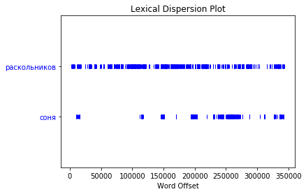

## Домашнее задание 2. Часть 2.

**Тема: Визуализация**

**Дедлайн: четверт 17.10.19 23:59**

Работы должны быть в отдельной тетрадке в том же репозитории, куда вы сдавали прошлую часть этого ДЗ.

**Важное: работы принимаются строго в ipynb (не скрипт, не скрипт в ячейке ipynb)**

**проверка на пеп и время временно отменяется!**

**Данные**

Данные вы получили при работе с предыдущим заданием.

**Задание**

Визуализировать информацию, которую вы получили из текста вашей книги и ее морфологического разбора

Пункты:

1. Перевести разметку в датафрейм, подобный тому, что был на семинаре

  - полное выполнение: датафрейм выглядит как тот, что на семинаре, столбец - это группа признаков (падеж), значения в нем - значения падежа или другой категории
  - частичное: каждое значение (например, именительный падеж) имеет отдельный столбик или у решения есть аналогичные недостатки

2. Повторить какие-то из графиков с семинара на своих книжных данных (обязательно - 3 штуки, дальше по желанию)

3. Придумать 2 своих визуализации, которые будут отличаться от того, что есть в конспекте
  - оси x и у отличаются (например, упорядоченные частоты существительных и прилагательных - это один тип)
  - используются другие типы графиков (тип графика - это боксплот, гистограмма и т.д)
  - (уточнения, возможно, будут еще тут появляться)

4. Освоить nltk dispersion plot и сделать такой график по героям вашей книги:
  - герои - это упоминания их имен
  - используйте лемматизированный текст



**Чек-лист**

1. Тетрадка с кодом
2. Каждый график имеет подписи по оси Х, Y и заголовок 
3. Обоснования для тех графиков, которые вы придумали от себя


**Подсказка №1**. Используйте PEP-8 проверку из первого конспекта. В первой ячейке должно быть вот это (выполнить в первую очередь):
```python
%load_ext pycodestyle_magic
%pycodestyle_on
```
И вам нужно следить за тем, что выводится при работе дальше в красных предупреждениях (например, отступы/пробелы и тд)

**Подсказка №2**. Что такое обоснование? Например: я использую барчарт, потому что по оси Х - дни недели, а по оси Y - суммарное количество твитов. Я хочу посмотреть на то, сколько твитов написано в каждый день недели и сравнить эти величины. Дни недели - величина дискретная (и вообще-то категориальная), например, поэтому гистограмму здесь использовать нельзя.

**Подсказка №3** Чтобы перевести в столбики по категориям типа падеж и тд, сначала выберите парсер, который вы хотите использовать.

- для майстема: смотрите чат, там есть подсказка, как сопоставить штуки типа "вин": "падеж"
- для пайморфи: вы просто идете по всем тегам в tag и сохраняете по нужному ключу

Смотрите то, как создается из словарей датафрейм в семинаре - это поможет вам правильно составить словарь.

Если у вас есть вопросы, задавайте в чате или пишите преподавателям

### Критерии оценки
 
**Это задание - часть единого ДЗ-2. За текущее задание будет 4 балла, еще 6 баллов будет весить следующее**
 
С этого раза является обязательным оформление домашней работы в jupyter notebook с комментариями и по PEP-8
 
<table>
    <tr><th>Балл</th><th>Критерий</th></tr>
    <tr><td>2 балла</td><td>Пункт 1 выполнен полностью правильно - 2 балла, частично - 1 балл, не выполнен - 0 баллов</td></tr>
    <tr><td>1 балл</td><td>Пункт 2 выполнен в объеме не меньше 3 графиков</td></tr>
    <tr><td>2 балла</td><td>По 1 баллу за каждый из 2 графиков</td></tr>
    <tr><td>1 балл</td><td>Получен такой же график в пункте 4 по вашей книге</td></tr>
</table>

**Ссылки на GiHub Classroom:**

будут позже
